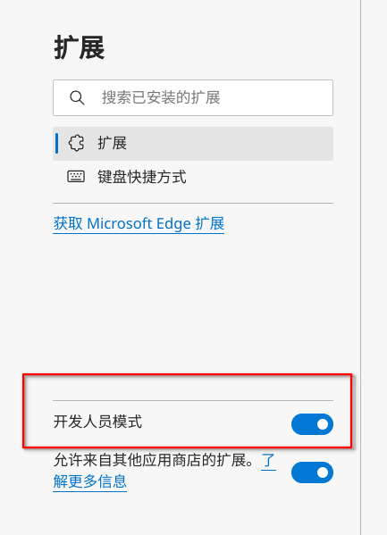
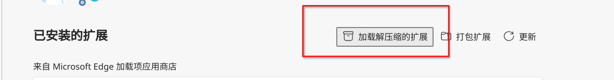
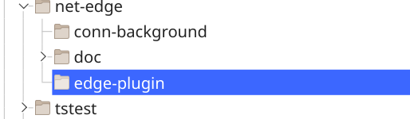
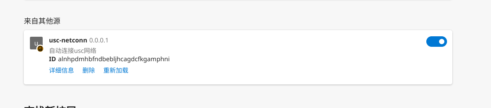
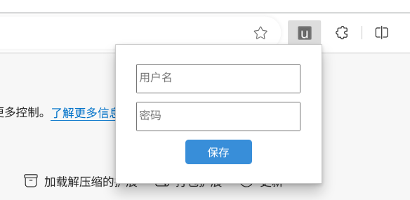

# usc-netconn

实现电脑开机自动连接USC网络

# 安装浏览器插件

1. 在release中下载对应系统的压缩包并解压到任意位置

2. 打开浏览器安装插件

   

   > 进入浏览器管理拓展页面，打开开发人员模式

   

   

   > 点击加载解压缩的拓展

   

   

   > 选中浏览器插件

   

   

   > 插件加载成功

3. 输入usc账户并保存

   

   

# windows 设置开机自启动

1. 桌面右键此电脑，点击管理

